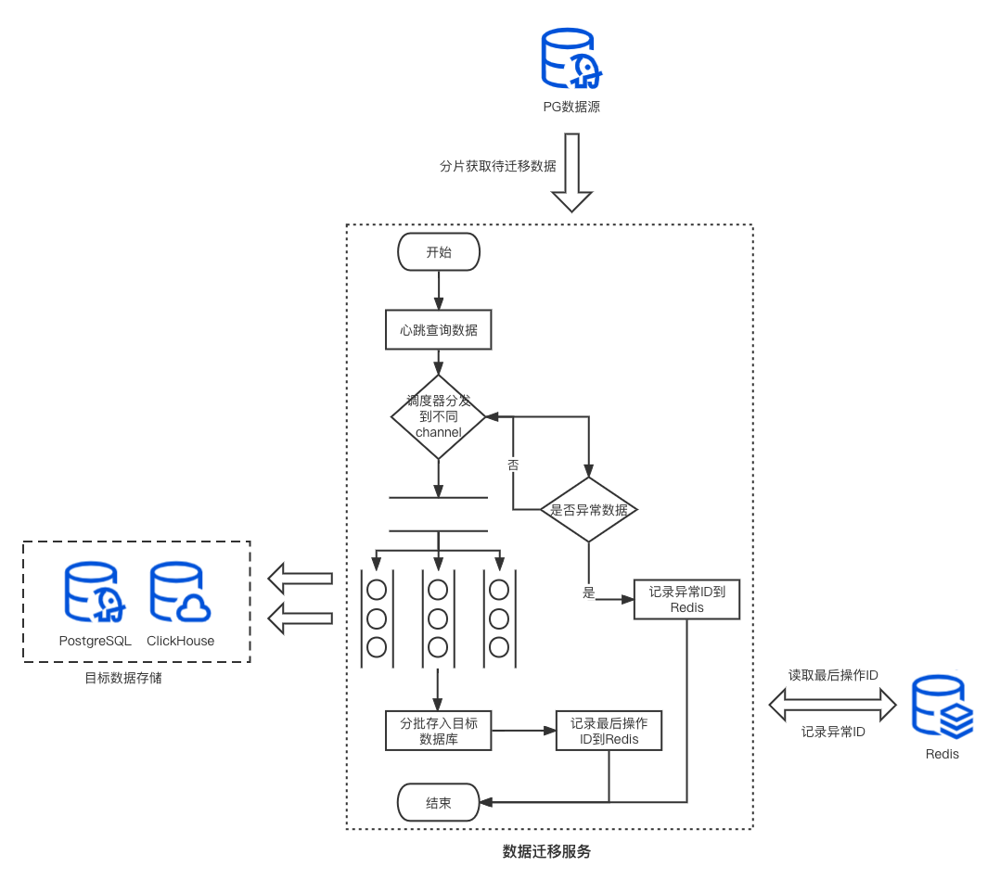

## at-migrator-tool

1. 文件结构梳理

    ```txt
    main.go # 程序入口文件
    doc/... # 存放子文档
    internal/collector/... # 任务进程会调用的采集器
    internal/conf/... # 解析配置的proto文件
    internal/contract/... # 契约(interface)
    internal/entity/... # 数据库实体
    internal/pkg/... # 其他
    internal/process/... # 加载到app容器的任务进程
    internal/application.go # app容器
    config.json # 配置文件
    config.json.example # 配置文件模板
    Makefile # 构建指令
    ......
    ```

2. 构建指令详解
   - 首次生成 *config.json* 配置文件

     ```bash
     make init
     ```
   - 编译 *internal/conf/conf.proto* 文件
     
     ```bash
     make config
     ```
   - 只运行不编译
     
     ```bash
     make run
     ```
   - 编译打包
     
     ```bash
     make build
     ```
3. 流程图


4. 子文档
   - [config](docs/config.md)
   - [deliver-uncheck-migrator](docs/deliver_uncheck_migrator.md)
   - [operate-record-migrator](docs/operate_record_migrator.md)